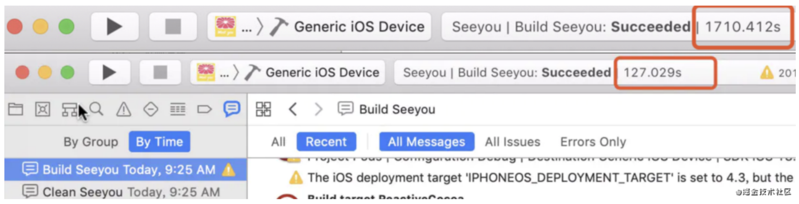
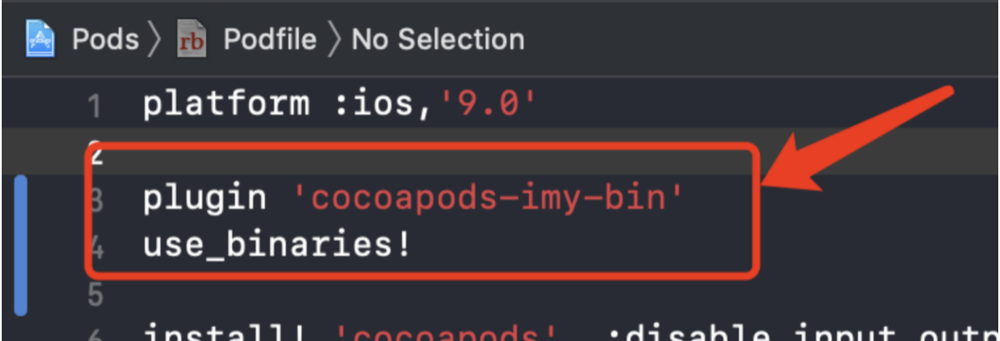

# 只要两行代码，即可提升10倍以上编译速度

 

### 特色：

 1. **无入侵、无感知、不影响现有业务，不影响现有代码框架、完全绿色产品，~**
 2. **轻量级，只要项目能编译通过就能使用，无视组件化、无视耦合**
 3. **完全自动化，不需要维护Pods库，一键使用、无需手动操作，**
 4. **一步步教你使用，新手也能欢乐玩转**
 5. **提供几个特色服务**
 6. **支持 使用与不使用 use_frameworks!**
 7. **少数支持swift项目二进制化编译的开源项目之一**

关于 插件具体的架构部署实践和更详细的资源，可以参考

> [iOS编译速度如何稳定提高10倍以上](https://juejin.cn/post/6903407900006449160)
>
> [iOS美团同款"ZSource"二进制调试实现](https://juejin.im/post/5f066cfa5188252e893a136e)
>
> [iOS教你如何像RN一样实时编译](https://juejin.im/post/6850037272415813645)
>
> [Swift编译慢？请看这里，全套开源](https://juejin.im/post/6890419459639476237)
>
> [OC-Demo](https://github.com/su350380433/cocoapods-imy-bin-demo)
>
> [Swift-OC-Demo](https://github.com/su350380433/Swift-OC-Demo)

 

### 更新

- 2021-01-12
  
  v0.3.1.3 fix some bugs
  
- 2020-11-02

  v0.3.0.11 支持纯Swift、纯Object-C、Swift-OC混编

## 一、使用教程

[使用教程](./使用教程.md)

 

## 二、感谢

**[cocoapods-bin](https://github.com/tripleCC/cocoapods-bin)**

[美团 iOS 工程 zsource 命令背后的那些事儿](https://tech.meituan.com/2019/08/08/the-things-behind-the-ios-project-zsource-command.html)

#### 您有什么更好的想法，可以提出来，我们一起来实现，共创一个强大的工具平台，同时也欢迎给我们提PR。 

